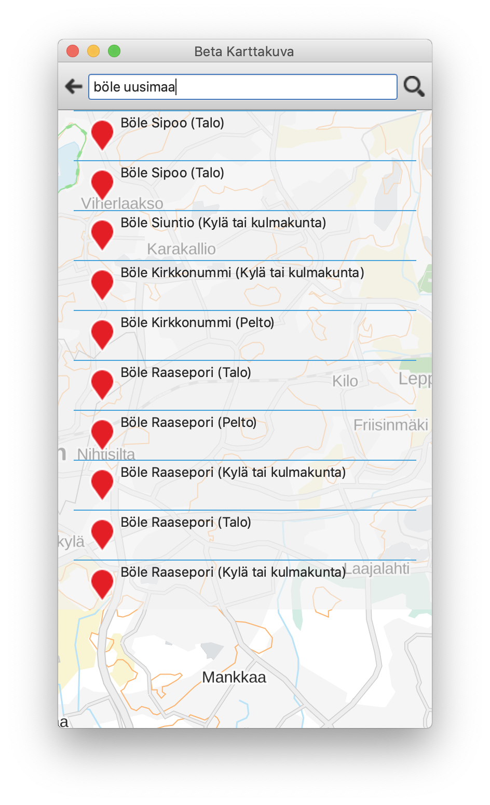

# beta-karttakuva-qt

a multi-platform map app mashup with help from qt.io examples

Unofficial Proof-of-concept Android app for <https://avoin-karttakuva.maanmittauslaitos.f> Vector tiles service.
see <https://beta-karttakuva.maanmittauslaitosfi> for more information.
No support or warranty of any kind is available. 

with geocoding 
( needs libqtgeoservices_betakarttakuva.dylib in plugins/geoservices )
( on a mac /Qt514/5.14.1/clang_64/plugins/geoservices/ )

