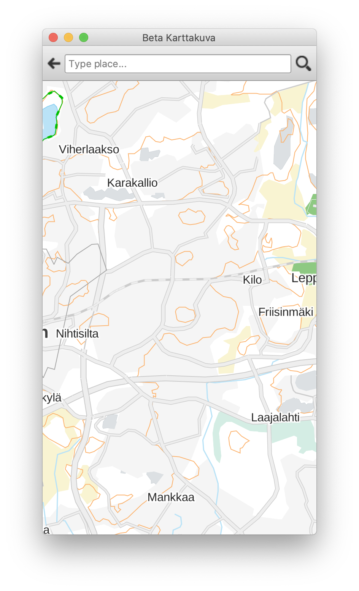

# beta-karttakuva-qt

a multi-platform map app mashup with help from qt.io examples

with geocoding 
( needs libqtgeoservices_betakarttakuva.dylib in plugins/geoservices )
( on a mac /Qt514/5.14.1/clang_64/plugins/geoservices/ )

